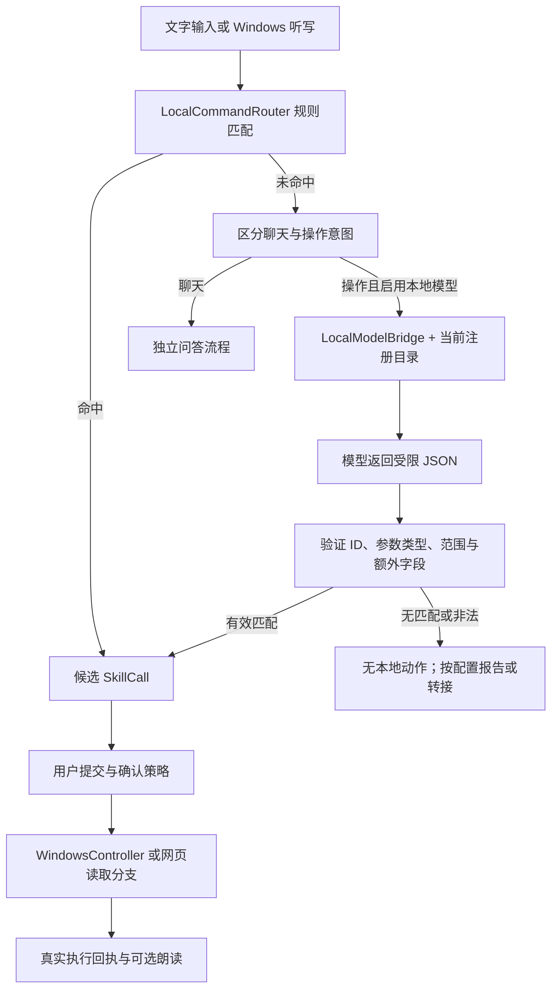

# 系统架构与扩展边界

KeyPilot 是一个 Windows 桌面助手。可复现项目把桌面应用、本地模型协议、受限电脑操作和语音合成分开，便于单独替换模型、验收动作和导入声音。开始运行见 [项目入口](START_HERE.md)，模型配置见 [本地模型门户](LOCAL_MODELS.md)，语音扩展见 [语音包规范](VOICE_PACKS.md)。

## 从用户输入到电脑操作

1. `LocalCommandRouter` 优先解析常用表达。命中规则不需要加载大模型；因此成功打开计算器本身不能证明模型已经接通。
2. 规则未命中时，应用会先区分普通聊天与操作意图。操作理解交给已启用的 `LocalModelBridge`；问答使用独立方法，不通过操作 JSON 伪装成动作。
3. 本地桥接根据 `SkillRegistry` 导出当前操作目录，向 Ollama 原生服务或 OpenAI 兼容服务发出请求。权重并不由本项目内置或训练。
4. 模型输出只包含 `matched`、`skill_id`、`arguments`。本地验证检查 ID 白名单、字段集合、参数类型、枚举及数值范围；无效输出不会形成操作调用。选择 `prompt` JSON 模式也保留本地验证。
5. 明确点击“执行”或提交文字属于用户主动提交。听写自动提交只有在已启用自动执行且注册描述同时为 `risk=low`、`confirmation=never` 时允许。复现版默认关闭自动执行。应用没有覆盖所有动作的第二次确认弹窗。
6. 电脑操作交给固定的执行分支；模型不能指定任意函数或 shell。`read_browser_page` 由 GUI 的网页读取流程处理。最终回执来自实际执行结果，模型预先生成的文字不作为成功证据。

无法匹配本地动作不等于整个应用停止一切工作：若用户另行启用了复杂代理，显式提交后的未匹配操作可能进入该代理。复现版默认关闭复杂代理；模型门户 CLI 始终只读，不进行这种转接。

## 模块与入口

| 部分 | 实现入口 | 职责 |
| --- | --- | --- |
| 统一启动 | [scripts/keypilot.py](../scripts/keypilot.py) | GUI、模型门户、语音包与环境检查入口 |
| 桌面调度 | [assistant_app.py](../desktop/keypilot/assistant_app.py) | 设置、输入、规则/模型分流、结果与用户交互 |
| 规则与注册表 | [assistant_router.py](../desktop/keypilot/assistant_router.py) | 加载 `desktop/skills/*/skill.json`、常用命令解析和自动执行条件 |
| 模型桥接 | [local_model.py](../desktop/keypilot/local_model.py) | 服务协议转换、模型目录、契约和响应校验 |
| 只读模型门户 | [local_model_portal.py](../desktop/keypilot/local_model_portal.py) | 导出契约、发现模型、探测、离线验证 |
| Windows 操作 | [windows_control.py](../desktop/keypilot/windows_control.py) | 应用、设置、音量/亮度、网址、时间任务等固定操作 |
| 网页与问答 | [browser_reader.py](../desktop/keypilot/browser_reader.py)、[cloud_bridge.py](../desktop/keypilot/cloud_bridge.py) | 可选页面读取与联网问答；不同于本地操作通道 |
| 语音播放 | [speech.py](../desktop/keypilot/speech.py)、[voice_worker.py](../desktop/keypilot/voice_worker.py) | 音色选择、独立工作进程与播放 |
| 云端语音模块 | [src/voice_assistant](../src/voice_assistant) | 可选声音训练、流式 TTS、指标与数据工具 |
| 模型接入 Skill | [SKILL.md](../skills/keypilot-model-adapter/SKILL.md) | 给不了解项目的模型/编码助手的接入工作流 |

本地模型门户目前是 GUI 设置和 CLI 工具，不是浏览器管理站点，也不是电脑控制 HTTP 服务器。新增外部模型无需学习内部 GUI：先连接其服务，再按导出的契约返回 JSON 即可。若外部工具希望直接远程执行动作，需要另行设计授权与执行接口；当前版本没有提供这种接口。

## 两类 Skill 与两类动作

`skills/keypilot-model-adapter/SKILL.md` 是自然语言工作流。`desktop/skills/<id>/skill.json` 是应用运行时描述，两者不能互相替代。运行时 `executor` 是描述字段，应用实际通过已编写的 Python 分支执行；复制一个 JSON 文件不会自动安装任意代码。

`desktop/keypilot/actions.py` 还支持键盘入口和启动器使用的 `command`、`hotkey`、`sequence` 等配置动作。这些是本机配置能力，**不属于本地模型的输出协议**。不要把这组动作名混入模型目录，也不要把模型返回的对象直接交给 `execute_action()`。

新增模型操作需要一起完成：

1. 添加具有明确输入、风险及确认声明的 `desktop/skills/<id>/skill.json`。
2. 在受控执行层实现该 ID；需要 GUI 上下文的操作在对应调度分支实现。
3. 为新参数补充足够的运行时校验与行为测试，尤其是文件路径、URL、数值和失败路径。
4. 重新导出契约，完成只读模型探测，再验收实际用户提交。

当前参数验证针对项目使用的 Schema 子集；新增复杂 Schema 关键字时，必须确认验证器真的支持它。添加注册项时也应同步检查规则路由、模型目录与执行器的一致性。

## 数据、依赖与实际限制

- 复现版把个人数据放在 `%LOCALAPPDATA%\KeyPilot-Repro`；可用绝对路径 `KEYPILOT_DATA_DIR` 指定独立实验目录。配置、对话记忆、时间任务和音色不会随公共源码一并发布。
- 桌面操作依赖 Windows、已安装的应用以及音频/显示硬件。打开应用除了固定别名，也会使用本机自定义路径和桌面/开始菜单候选；它不是隔离系统进程的沙箱。
- “本地模型”只说明所配置的推理服务位置。若端点是远程地址，请求仍会离开本机。Windows 听写、浏览器、天气、云端问答与云端 TTS 有各自的网络依赖，不能因此宣称整个应用完全离线。
- 模型 JSON 校验约束可调用范围，无法证明语义理解正确。规则优先也意味着模型提示词中的“拒绝多步骤”不自动约束规则分支；组合请求不应作为单动作自动执行的保证。
- 当前没有通用多步骤规划执行器、任意终端执行、删除文件 Skill 或统一任务回滚。日历添加生成草稿，最终添加依赖用户在日历应用中确认。
- 模型权重、声音录音、训练产物与第三方服务凭据由复现者自行准备。发布范围与导入方法见项目入口和语音规范。
